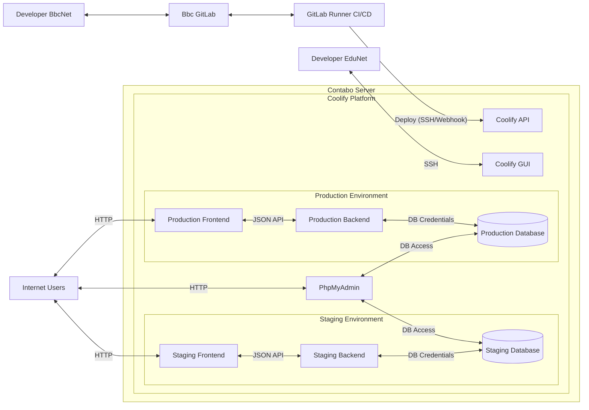
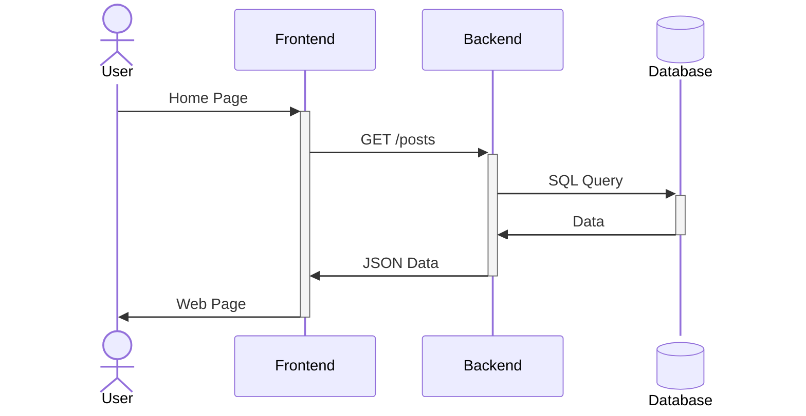

# Architecture

```mermaid
flowchart LR

%% ============ USERS ============
Users[Internet Users]
DevEdu[Developer EduNet]
DevBbc[Developer BbcNet]

%% ============ GITLAB ============
GitLab[Bbc GitLab]
Runner[GitLab Runner CI/CD]

DevBbc <--> GitLab
GitLab <--> Runner

%% ============ SERVER ============
subgraph Contabo Server
    
    subgraph Coolify Platform

        CoolifyApi[Coolify API]
        CoolifyGui[Coolify GUI]
        PhpMyAdmin[PhpMyAdmin]

        subgraph Production Environment
            ProdFrontend[Production Frontend]
            ProdBackend[Production Backend]
            ProdDB[(Production Database)]
        end

        subgraph Staging Environment
            StagingFrontend[Staging Frontend]
            StagingBackend[Staging Backend]
            StagingDB[(Staging Database)]
        end
    end
end

%% ============ ACCESS ============
DevEdu <-- SSH --> CoolifyGui
Users <-- HTTP --> ProdFrontend
Users <-- HTTP --> PhpMyAdmin
Users <-- HTTP --> StagingFrontend

%% ============ FRONTEND BACKEND ============
ProdFrontend <-- JSON API --> ProdBackend
StagingFrontend <-- JSON API --> StagingBackend


%% ============ BACKEND DATABASE ============
PhpMyAdmin <-- DB Access --> ProdDB

ProdBackend <-- DB Credentials --> ProdDB
StagingBackend <-- DB Credentials --> StagingDB

PhpMyAdmin <-- DB Access --> StagingDB

%% ============ DEPLOYMENT ============
Runner -- Deploy (SSH/Webhook) --> CoolifyApi
```

## Beispiel Kommunikation

```mermaid
sequenceDiagram
    participant User@{"type": "actor"}
    participant Frontend
    participant Backend
    participant Database@{ "type" : "database" }

    User->>+Frontend: Home Page
    Frontend->>+Backend: GET /posts
    Backend->>+Database: SQL Query
    Database->>-Backend: Data
    Backend->>-Frontend: JSON Data
    Frontend->>-User: Web Page
```