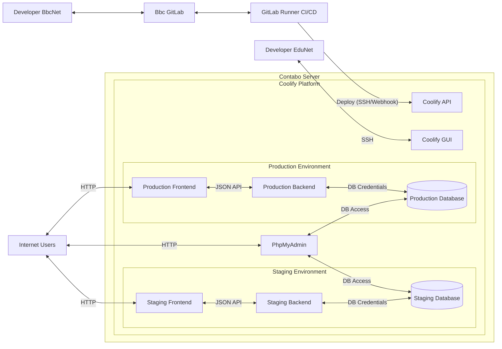
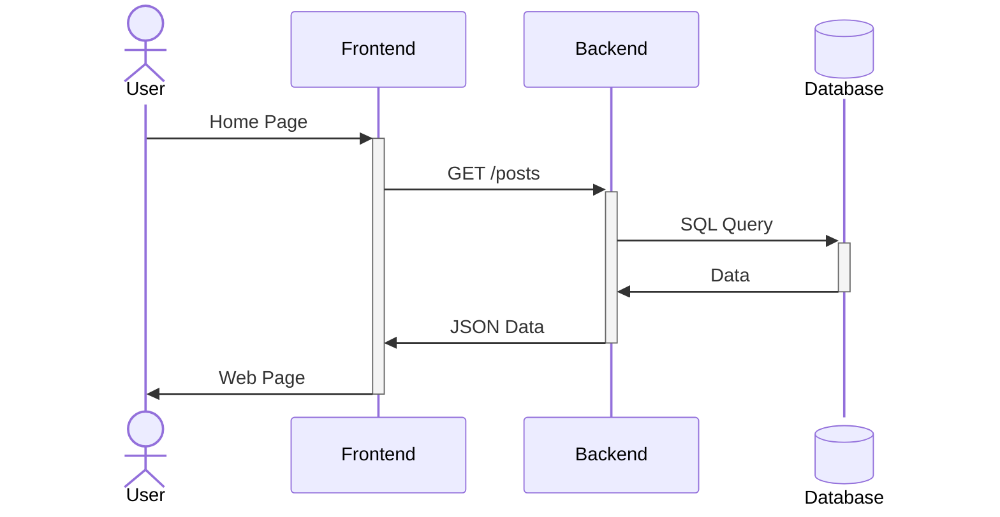

# Architecture

Diese Architektur basiert auf einem Contabo Server, auf dem die Plattform Coolify läuft.
Coolify verwaltet die Container für Frontend, Backend und Datenbanken für sowohl Production als auch Staging Umgebung.

Benutzer greifen über HTTPS auf das Frontend zu. Das Frontend kommuniziert über eine REST API mit dem Backend und tauscht Daten im JSON-Format aus. Das Backend greift über das MySQL-Protokoll auf die Datenbank zu.

Deployments erfolgen automatisiert über GitLab CI/CD. Der GitLab Runner baut die Anwendung und deployt sie über SSH oder Webhooks auf Coolify, welches die Container aktualisiert.

## Beispiel Kommunikation

## Schnittstellen und Kommunikation

### User &rarr; Frontend

Der User gerift auf das Frontend mit einem Webbrowser zu. Das Frontend gibt dem User anschliessend eine Web Page zurück

| Protokoll | Port | Datenformat   |
| --------- | ---- | ------------- |
| HTTP      | 80   | HTML, CSS, JS |

### Frontend &rarr; Backend

Das Frontend macht anfragen auf das Backend um beschtimmte Daten zu bekommen oder zu Modifizieren. Dies Funktioniert über eine REST API.

| Protokoll | Port | Datenformat |
| --------- | ---- | ----------- |
| HTTP      | 80   | JSON        |

### Backend &rarr; Database

Das Backend arbeitet direkt mit der Datenbank. Dazu benutzt es DB Credentials (User, Passwort, Host, DB Name) um sich zu verbinden.

| Protokoll | Port | Datenformat |
| --------- | ---- | ----------- |
| MySQL TCP | 3306 | SQL         |

### User &rarr; PhpMyAdmin

Der User gerift auf PhpMyAdmin mit einem Webbrowser zu. PhpMyAdmin bietet anschliessend eine GUI für die Datenbankverwaltung.

| Protokoll | Port | Datenformat   |
| --------- | ---- | ------------- |
| HTTP      | 80   | HTML, CSS, JS |

### PhpMyAdmin &rarr; Database

PhpMyAdmin kommuniziert direkt mit der Datenbank. Dazu benutzt es auch DB Credentials.

| Protokoll | Port | Datenformat |
| --------- | ---- | ----------- |
| MySQL TCP | 3306 | SQL         |

### GitLab Runner &rarr; Coolify API

Der GitLab Runner ruft die Coolify API zum redeployment auf. Dazu verwendet es ein API Token.

| Protokoll | Port | Datenformat |
| --------- | ---- | ----------- |
| HTTPS     | 443  | -           |

### Developer &rarr; Coolify GUI

Der Developer kann die verschiedenen Resourcen direkt über das Coolify GUI kontrollieren. Dazu sind eine Email und ein Passwort nötig.

| Protokoll | Port | Datenformat   |
| --------- | ---- | ------------- |
| HTTP      | 80   | HTML, CSS, JS |
