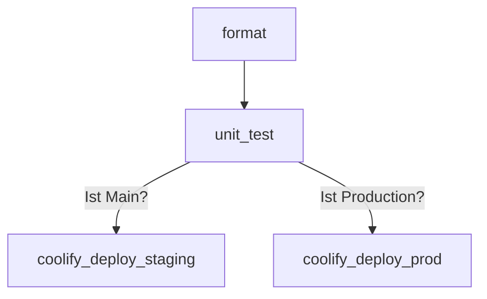

# Backend CI/CD

## Konfiguration

### Variables

- `COOLIFY_PROD_URL`:`<coolify_prod_deploy_url>`
- `COOLIFY_STAGING_URL`:`<coolify_staging_deploy_url>`
- `COOLIFY_TOK`:`<coolify_deploy_api_token>`
- `AUTH_HEADER`:`Authorization: Bearer $COOLIFY_TOK`

### Cache

- `.gradle/wrapper`
- `.gradle/caches`

## Stages

### Format

- image: `gradle:8.6-jdk21-alpine`
- script: `./gradlew --build-cache --parallel spotlessCheck`
- only: `merge_requests`

In dieser Stage wird geschaut, ob der Code richtig formatiert ist, um einen einheitlichen style zu behalten. 
Dazu wird ein plugin names spotless benutzt. Mit spotlessCheck wird der ganze code auf die eingestellte Formatierung geprüft. Bei fehlern bricht die Pipline ab. Beheben kann man es mit dem command `spotlessApply`.

`--build-cache --parallel` bewirken, dass gradle schneller läuft, dah es den cach benutzen kann, und tasks parallel ausführen kann.

### Unit Test

- image: `gradle:8.6-jdk21-alpine`
- script: `./gradlew --build-cache --parallel test`
- only: `merge_requests`

In dieser Stage werden alle Tests ausgefürt, um die funktion des Codes sicher zu stellen. Ist ein Test nicht erfolgreich, bricht die Pipeline ab. 

Die ausgaben von den Tests werden als Artefakt gespeichert.

`--build-cache --parallel` bewirken, dass gradle schneller läuft, dah es den cach benutzen kann, und tasks parallel ausführen kann.

### Coolify Deploy Staging

- image: `curlimages/curl:latest`
- script: `curl -X GET "$COOLIFY_STAGING_URL" -H "$AUTH_HEADER"`
- only: `main`

Diese Stage läuft nur wenn der Code auf `main` gemerged wird. Es macht eine anfrage auf den Coolify server, welche anschliessend ein Deployment für die Staging Backend ausführt. Das Token und die URL werden als Variable an den CI/CD prozess übergeben.

### Coolify Deploy Prod

- image: `curlimages/curl:latest`
- script: `curl -X GET "$COOLIFY_PROD_URL" -H "$AUTH_HEADER"`
- only: `production`

Diese Stage läuft nur wenn der Code auf `production` gemerged wird. Es macht eine anfrage auf den Coolify server, welche anschliessend ein Deployment für die Production Backend rescource ausführt. Das Token und die URL werden als Variable an den CI/CD prozess übergeben.
