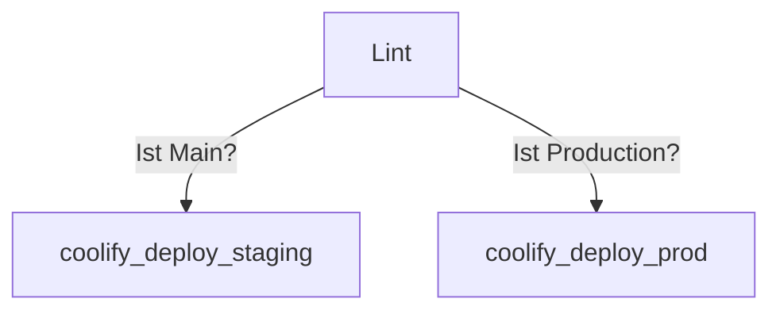

# Frondend CI/CD

## Konfiguration

### Variables

- `COOLIFY_PROD_URL`:`<coolify_prod_deploy_url>`
- `COOLIFY_STAGING_URL`:`<coolify_staging_deploy_url>`
- `COOLIFY_TOK`:`<coolify_deploy_api_token>`
- `AUTH_HEADER`:`Authorization: Bearer $COOLIFY_TOK`

### Cache

- `node_modules/`
- `.npm/`

## Stages

### Lint

- image: `node:20`
- script:
  - `npm ci --cache .npm --prefer-offline`
  - `npm run lint`

In dieser Stage wird geschaut, ob der Code richtig formatiert ist und beschtimte Regeln befolgt, um einen einheitlichen style und gewisse code standarts zu behalten.
Dazu wird ES Lint benutzt.

### Coolify Deploy Staging

- image: `curlimages/curl:latest`
- script: `curl -X GET "$COOLIFY_STAGING_URL" -H "$AUTH_HEADER"`
- only: `main`

Diese Stage läuft nur wenn der Code auf `main` gemerged wird. Es macht eine anfrage auf den Coolify server, welche anschliessend ein Deployment für die Staging Frontend ausführt. Das Token und die URL werden als Variable an den CI/CD prozess übergeben.

### Coolify Deploy Prod

- image: `curlimages/curl:latest`
- script: `curl -X GET "$COOLIFY_PROD_URL" -H "$AUTH_HEADER"`
- only: `production`

Diese Stage läuft nur wenn der Code auf `production` gemerged wird. Es macht eine anfrage auf den Coolify server, welche anschliessend ein Deployment für die Production Frontend rescource ausführt. Das Token und die URL werden als Variable an den CI/CD prozess übergeben.