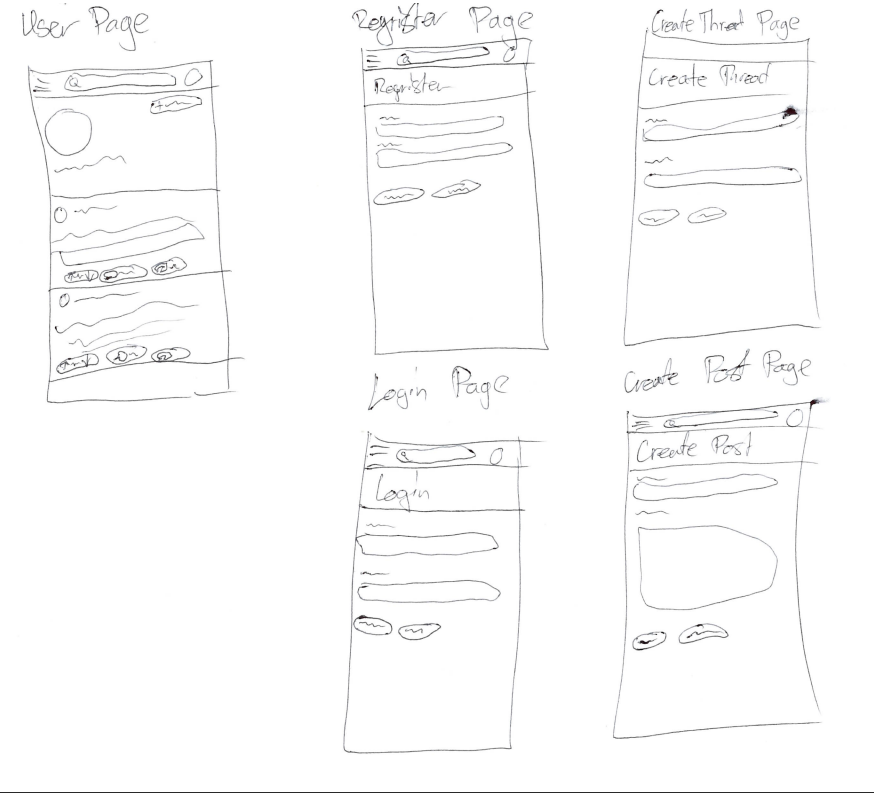
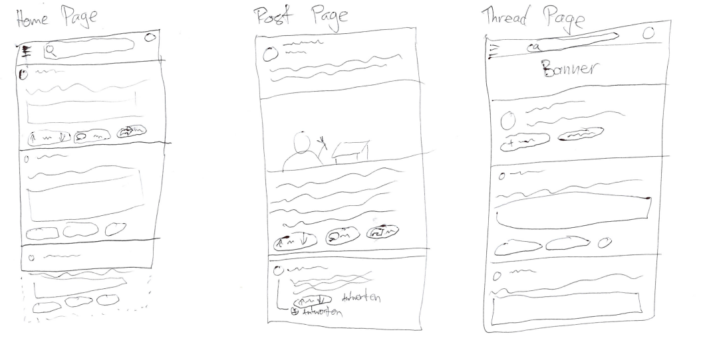
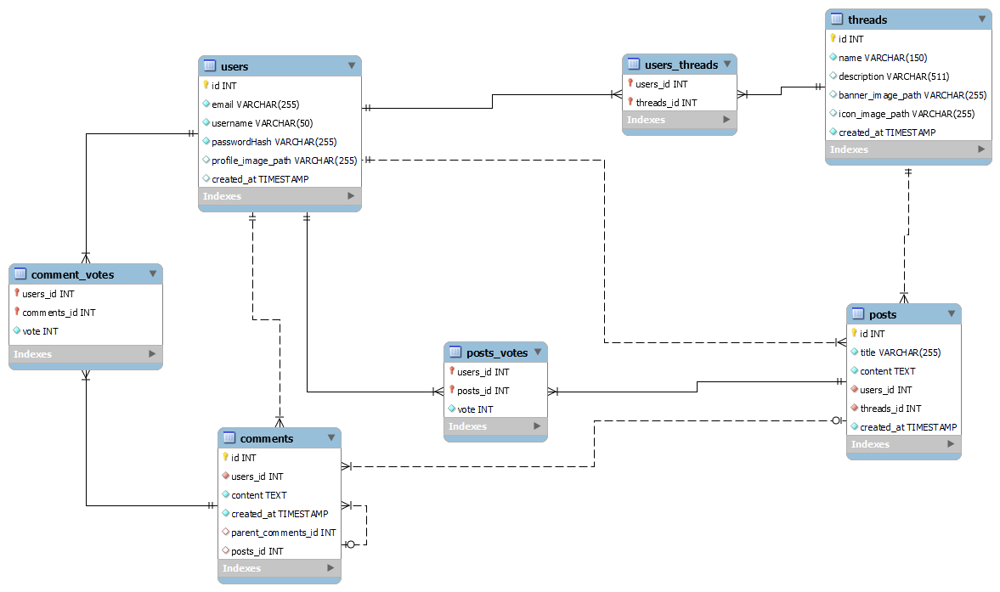

# Projektantrag Wrodit

## Projektbeschreibung

Wrodit ist eine Plattform, die eine Nachbildung von Reddit darstellt. Nutzer:innen können ein Konto erstellen, eigene Threads anlegen und in diesen Threads Posts veröffentlichen. Die Posts können Text, Bilder oder Fragen zu bestimmten Themen enthalten, und andere Nutzer:innen können darauf antworten und ihre Meinung teilen. Ausserdem können Posts geliket oder disliket werden, um Zustimmung oder Ablehnung auszudrücken. Zusätzlich gibt es eine Übersicht über alle eigenen Threads und Posts, sodass man leicht den Überblick über seine Beiträge behält. Wrodit soll es den Nutzer:innen ermöglichen, sich aktiv auszutauschen, Wissen zu teilen und an Diskussionen teilzunehmen.

### Zielgruppe

Wrodit richtet sich an alle, die ihre Meinung ausdrücken und sich darüber austauschen möchten, sowie an Menschen, die fach­spezifische Fragen haben und Antworten suchen. Wir erwarten, dass die meisten Nutzer:innen zwischen 16 und 35 Jahre alt sind. Die Plattform wird überwiegend über Smartphones genutzt, aber es wird auch Nutzer:innen geben, die die Desktop-Version bevorzugen.

### Ziele

Wrodit soll Menschen miteinander verbinden, die sich für gleiche Themen interessieren, und Raum für Diskussionen schaffen, wenn es Meinungsunterschiede gibt. Durch die Community entsteht zudem die Möglichkeit, fach­spezifische Fragen schnell und zuverlässig beantwortet zu bekommen. Die Plattform soll einen Ort bieten, an dem sich Nutzer:innen aktiv austauschen, ihre Meinung äußern und voneinander lernen können.

## User Stories

1. Als User möchte ich eine Möglichkeit haben, mich zu registrieren, damit ich auch einen Account habe, und mit anderen interagieren kann.
2. Als User möchte ich eine Login-Seite haben, damit ich auf meinen Account zugreifen kann.
3. Als User möchte ich eine Homeseite, damit ich verschiedene Einträge sehen kann, ohne danach zu suchen.
4. Als User möchte ich eine Detailansicht für die verschiedenen Posts haben, damit ich den ganzen Inhalt sowie die Kommentare sehen kann.
5. Als User möchte ich eine Thread-Seite, welche mir alle Posts in einem bestimmten Thread anzeigt, damit ich nach spezifischen Themen Posts sehe.
6. Als User möchte ich die Möglichkeit haben, einen Post oder einen anderen Kommentar zu kommentieren, damit ich meine Meinung sagen kann.
7. Als User möchte ich einen Post erstellen können, damit ich etwas erzählen kann.
8. Als User möchte ich einen Thread erstellen können, damit ich einen Raum mit Post zu einem von mir gewählten Thema habe.
9. Als User möchte ich eine Profilseite haben, damit ich die Informationen zu einem Profil sehen kann.
10. Als User möchte ich Posts und Comments liken und disliken können, damit ich anderen helfen kann, einzuschätzen, ob die Information in meinen Augen gut ist.
11. Als User möchte ich einen Button haben, der mir den Link des Posts oder Threads kopiert, damit ich ihn an meine Kollegen senden kann.
12. Als User möchte ich meine Posts löschen können, falls ich aus Versehen etwas poste.
13. Als User möchte ich meinen Account löschen können, damit ich von der Plattform verschwinden kann.
14. Als User möchte ich den Content des Posts in Markdown formatieren können, damit ich den Text stylen kann.
15. Als User möchte ich in der Detailansicht von einem Post die Kommentare unter dem Post sehen, damit ich sie leicht finden kann.
16. Als User möchte ich , dass Posts nach schädlichen oder bösen Inhalten gescannt werden und bei erkannten Inhalten blockiert werden, damit die Plattform freundlich bleibt.
17. Als User möchte ich meine Inhalte bearbeiten können, damit ich Fehler korrigieren kann.
18. (Optional) Als User möchte ich beim Erstellen eines Threads ein Banner und ein Icon hochladen können, damit der Thread erkennbar ist.
19. (Optional) Als User möchte ich ein Profilbild hochladen können, damit ich meine Persönlichkeit zeigen kann.
20. (Optional) Als User möchte ich nach bestimmten Sachen mit einem Feld suchen können, damit ich etwas Bestimmtes finden kann.

## Sitemap

## Datenmodell

