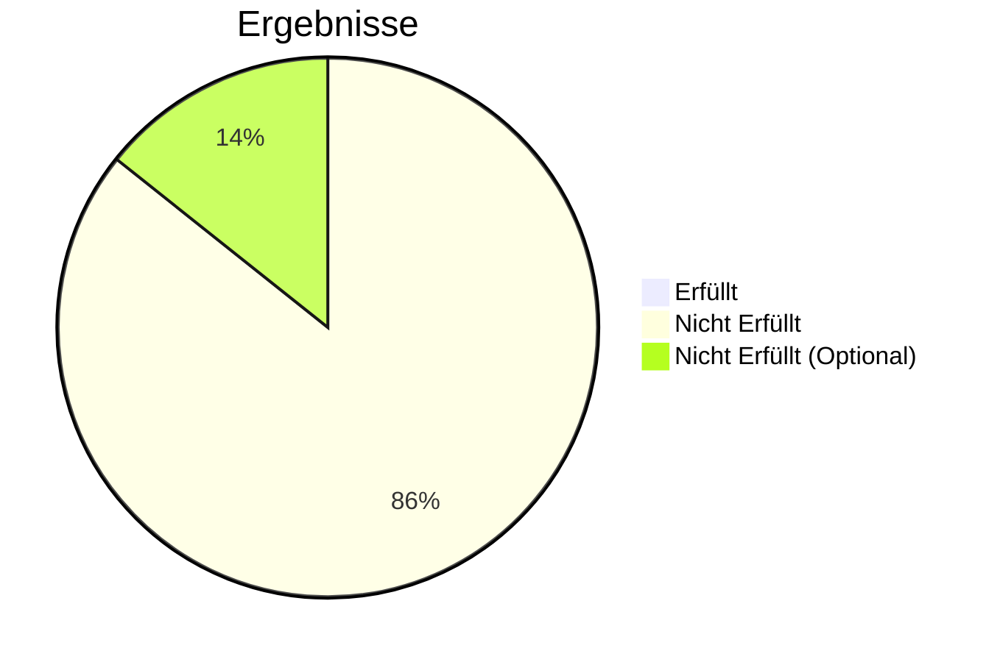

# User Acceptance Test

- Date: DD.MM.YYYY, HH:MM
- Git Commit: Commit-Hash
- Tester: Vorname, Nachname

## UAT 01 - Registrierung

|               |                                                      |
| ------------- | ---------------------------------------------------- |
| ID            | UAT 01                                               |
| User Story    | US 01                                                |
| Voraussetzung | Keine                                                |
| Ablauf        | User öffnet Registrierung, gibt Daten ein, bestätigt |
| Erwartet      | User kann Account erstellen                          |
| Ergebniss     |                                                      |
| Beschtanden   | ✓ / ✗                                                |

## UAT 02 - Login

|               |                                  |
| ------------- | -------------------------------- |
| ID            | UAT 02                           |
| User Story    | US 02                            |
| Voraussetzung | Registrierter Account            |
| Ablauf        | User gibt Email und Passwort ein |
| Erwartet      | User kann sich einloggen         |
| Ergebniss     |                                  |
| Beschtanden   | ✓ / ✗                            |

## UAT 03 - Homeseite anzeigen

|               |                                      |
| ------------- | ------------------------------------ |
| ID            | UAT 03                               |
| User Story    | US 03                                |
| Voraussetzung | Login                                |
| Ablauf        | User öffnet Homeseite                |
| Erwartet      | Posts werden auf Homeseite angezeigt |
| Ergebniss     |                                      |
| Beschtanden   | ✓ / ✗                                |

## UAT 04 - Post Detailansicht

|               |                                      |
| ------------- | ------------------------------------ |
| ID            | UAT 04                               |
| User Story    | US 04                                |
| Voraussetzung | Post existiert                       |
| Ablauf        | User klickt auf Post                 |
| Erwartet      | Post und Kommentare werden angezeigt |
| Ergebniss     |                                      |
| Beschtanden   | ✓ / ✗                                |

## UAT 05 - Thread Seite

|               |                                         |
| ------------- | --------------------------------------- |
| ID            | UAT 05                                  |
| User Story    | US 05                                   |
| Voraussetzung | Thread existiert                        |
| Ablauf        | User öffnet Thread                      |
| Erwartet      | Alle Posts des Threads werden angezeigt |
| Ergebniss     |                                         |
| Beschtanden   | ✓ / ✗                                   |

## UAT 06 - Kommentieren

|               |                                    |
| ------------- | ---------------------------------- |
| ID            | UAT 06                             |
| User Story    | US 06                              |
| Voraussetzung | Login                              |
| Ablauf        | User schreibt Kommentar und sendet |
| Erwartet      | Kommentar wird gespeichert         |
| Ergebniss     |                                    |
| Beschtanden   | ✓ / ✗                              |

## UAT 07 - Post erstellen

|               |                          |
| ------------- | ------------------------ |
| ID            | UAT 07                   |
| User Story    | US 07                    |
| Voraussetzung | Login                    |
| Ablauf        | User erstellt neuen Post |
| Erwartet      | Neuer Post wird erstellt |
| Ergebniss     |                          |
| Beschtanden   | ✓ / ✗                    |

## UAT 08 - Thread erstellen

|               |                            |
| ------------- | -------------------------- |
| ID            | UAT 08                     |
| User Story    | US 08                      |
| Voraussetzung | Login                      |
| Ablauf        | User erstellt Thread       |
| Erwartet      | Neuer Thread wird erstellt |
| Ergebniss     |                            |
| Beschtanden   | ✓ / ✗                      |

## UAT 09 - Profilseite

|               |                                      |
| ------------- | ------------------------------------ |
| ID            | UAT 09                               |
| User Story    | US 09                                |
| Voraussetzung | Profil existiert                     |
| Ablauf        | User öffnet Profilseite              |
| Erwartet      | Profilinformationen werden angezeigt |
| Ergebniss     |                                      |
| Beschtanden   | ✓ / ✗                                |

## UAT 10 - Likes / Dislikes

|               |                               |
| ------------- | ----------------------------- |
| ID            | UAT 10                        |
| User Story    | US 10                         |
| Voraussetzung | Login                         |
| Ablauf        | User klickt Like oder Dislike |
| Erwartet      | Bewertung wird gespeichert    |
| Ergebniss     |                               |
| Beschtanden   | ✓ / ✗                         |

## UAT 11 - Link kopieren

|               |                                     |
| ------------- | ----------------------------------- |
| ID            | UAT 11                              |
| User Story    | US 11                               |
| Voraussetzung | Post oder Thread existiert          |
| Ablauf        | User klickt Copy-Link Button        |
| Erwartet      | Link wird in Zwischenablage kopiert |
| Ergebniss     |                                     |
| Beschtanden   | ✓ / ✗                               |

## UAT 12 - Post löschen

|               |                        |
| ------------- | ---------------------- |
| ID            | UAT 12                 |
| User Story    | US 12                  |
| Voraussetzung | Eigener Post existiert |
| Ablauf        | User klickt Löschen    |
| Erwartet      | Post wird gelöscht     |
| Ergebniss     |                        |
| Beschtanden   | ✓ / ✗                  |

## UAT 13 - Account löschen

|               |                       |
| ------------- | --------------------- |
| ID            | UAT 13                |
| User Story    | US 13                 |
| Voraussetzung | Login                 |
| Ablauf        | User löscht Account   |
| Erwartet      | Account wird gelöscht |
| Ergebniss     |                       |
| Beschtanden   | ✓ / ✗                 |

## UAT 14 - Markdown schreiben

|               |                                      |
| ------------- | ------------------------------------ |
| ID            | UAT 14                               |
| User Story    | US 14                                |
| Voraussetzung | Post Editor geöffnet                 |
| Ablauf        | User schreibt Markdown und speichert |
| Erwartet      | Markdown wird gespeichert            |
| Ergebniss     |                                      |
| Beschtanden   | ✓ / ✗                                |

## UAT 15 - Markdown anzeigen

|               |                                    |
| ------------- | ---------------------------------- |
| ID            | UAT 15                             |
| User Story    | US 15                              |
| Voraussetzung | Post mit Markdown existiert        |
| Ablauf        | User öffnet Post                   |
| Erwartet      | Markdown wird formatiert angezeigt |
| Ergebniss     |                                    |
| Beschtanden   | ✓ / ✗                              |

## UAT 16 - Kommentare anzeigen

|               |                                        |
| ------------- | -------------------------------------- |
| ID            | UAT 16                                 |
| User Story    | US 16                                  |
| Voraussetzung | Post Detailansicht                     |
| Ablauf        | User öffnet Post Detailansicht         |
| Erwartet      | Kommentare werden unter Post angezeigt |
| Ergebniss     |                                        |
| Beschtanden   | ✓ / ✗                                  |

## UAT 17 - Content Filter

|               |                                        |
| ------------- | -------------------------------------- |
| ID            | UAT 17                                 |
| User Story    | US 17                                  |
| Voraussetzung | Post wird erstellt                     |
| Ablauf        | User postet Inhalt mit verbotenem Wort |
| Erwartet      | Post wird blockiert                    |
| Ergebniss     |                                        |
| Beschtanden   | ✓ / ✗                                  |

## UAT 18 - Inhalte bearbeiten

|               |                                    |
| ------------- | ---------------------------------- |
| ID            | UAT 18                             |
| User Story    | US 18                              |
| Voraussetzung | Eigener Post existiert             |
| Ablauf        | User bearbeitet Post und speichert |
| Erwartet      | Änderungen werden gespeichert      |
| Ergebniss     |                                    |
| Beschtanden   | ✓ / ✗                              |

## UAT 19 - Thread Banner / Icon (Optional)

|               |                                |
| ------------- | ------------------------------ |
| ID            | UAT 19                         |
| User Story    | US 19                          |
| Voraussetzung | Thread erstellen               |
| Ablauf        | User lädt Banner und Icon hoch |
| Erwartet      | Bilder werden gespeichert      |
| Ergebniss     |                                |
| Beschtanden   | ✓ / ✗                          |

## UAT 20 - Profilbild hochladen (Optional)

|               |                             |
| ------------- | --------------------------- |
| ID            | UAT 20                      |
| User Story    | US 20                       |
| Voraussetzung | Login                       |
| Ablauf        | User lädt Profilbild hoch   |
| Erwartet      | Profilbild wird gespeichert |
| Ergebniss     |                             |
| Beschtanden   | ✓ / ✗                       |

## UAT 21 - Suche (Optional)

|               |                                 |
| ------------- | ------------------------------- |
| ID            | UAT 21                          |
| User Story    | US 21                           |
| Voraussetzung | Inhalte existieren              |
| Ablauf        | User gibt Suchbegriff ein       |
| Erwartet      | Suchergebnisse werden angezeigt |
| Ergebniss     |                                 |
| Beschtanden   | ✓ / ✗                           |
