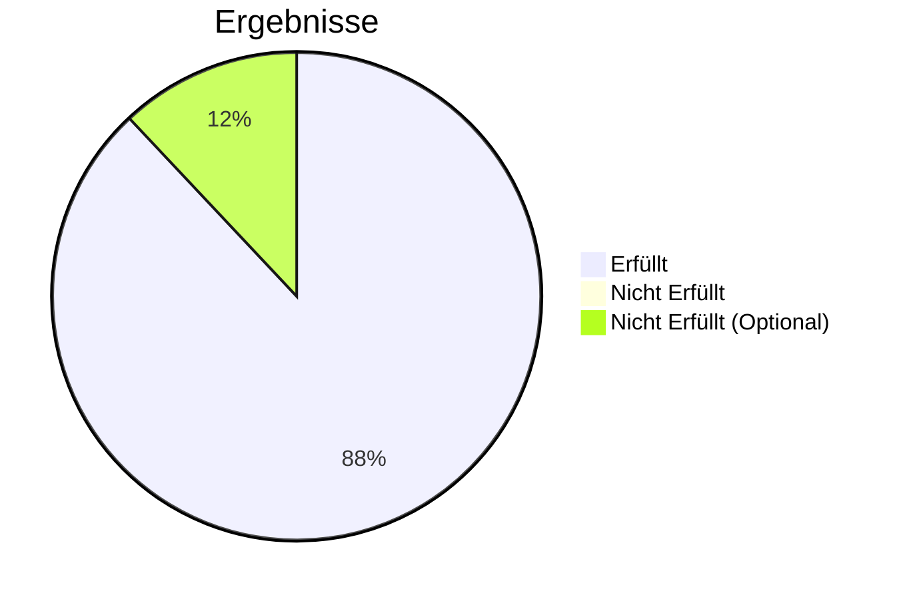

# UAT Testprotokoll – Wrodit

## Projekt

Wrodit Webapplikation

## Umgebung

Staging

## Commit

d175950e

## Datum

01.04.2026

## Tester

Noah

---

---

## Legende

- [x] = bestanden
- [ ]  = fehlgeschlagen

---

## Testfälle & Ergebnisse

### UAT 01 – Registrierung (erfolgreich)

- [x]  Ergebnis
- Bemerkung:

---

### UAT 02 – Registrierung (fehlerhaft)

- [x]  Ergebnis
- Bemerkung:

---

### UAT 03 – Login (erfolgreich)

- [x]  Ergebnis
- Bemerkung:

---

### UAT 04 – Login (fehlerhaft)

- [x]  Ergebnis
- Bemerkung:

---

### UAT 05 – Profilseite

- [x]  Ergebnis
- Bemerkung:

---

### UAT 06 – Thread erstellen (gültig)

- [x]  Ergebnis
- Bemerkung:

---

### UAT 07 – Thread erstellen (ungültig)

- [x]  Ergebnis
- Bemerkung:

---

### UAT 08 – Post erstellen (gültig)

- [x]  Ergebnis
- Bemerkung:

---

### UAT 09 – Post erstellen (ungültig)

- [x]  Ergebnis
- Bemerkung:

---

### UAT 10 – Homeseite anzeigen

- [x]  Ergebnis
- Bemerkung:

---

### UAT 11 – Thread Seite

- [x]  Ergebnis
- Bemerkung:

---

### UAT 12 – Post Detailansicht

- [x]  Ergebnis
- Bemerkung:

---

### UAT 13 – Kommentieren

- [x]  Ergebnis
- Bemerkung:

---

### UAT 14 – Kommentare anzeigen

- [x]  Ergebnis
- Bemerkung:

---

### UAT 15 – Likes / Dislikes

- [x]  Ergebnis
- Bemerkung:

---

### UAT 16 – Link kopieren

- [x]  Ergebnis
- Bemerkung:

---

### UAT 17 – Post löschen

- [x]  Ergebnis
- Bemerkung:

---

### UAT 18 – Account löschen

- [x]  Ergebnis
- Bemerkung:

---

### UAT 19 – Markdown schreiben

- [x]  Ergebnis
- Bemerkung:

---

### UAT 20 – Markdown anzeigen

- [x]  Ergebnis
- Bemerkung:

---

### UAT 21 – Content Filter

- [x]  Ergebnis
- Bemerkung:

---

### UAT 22 – Inhalte bearbeiten

- [x]  Ergebnis
- Bemerkung:

---

### UAT 23 – Thread Banner / Icon (Optional)

- [ ]  Ergebnis
- Bemerkung:

---

### UAT 24 – Profilbild hochladen (Optional)

- [ ]  Ergebnis
- Bemerkung:

---

### UAT 25 – Suche (Optional)

- [ ]  Ergebnis
- Bemerkung:

---

## Fazit

- [x] System ist abnahmebereit
- [ ] System ist **nicht** abnahmebereit

## Zusammenfassung

- Bestanden: 22
- Fehlgeschlagen: 3
- Gesamt: 25
